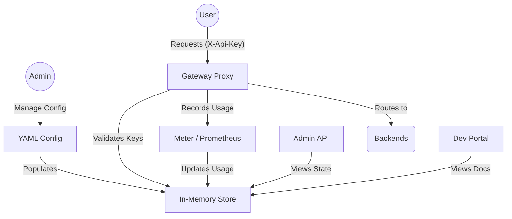

# APIM Core architecture

APIM Core uses a modular layout with clear separation between configuration, state, gateway, metrics, and management. This document gives a high-level overview for operators and contributors.

## Component overview

## Main components

### 1. Configuration (`config/`)

Loads and parses the main `config.yaml`. Supports the full hierarchy: gateway, server, products, APIs, subscriptions, security, and devportal. The file can be reloaded at runtime (hot-reload).

### 2. Store (`internal/store/`)

Thread-safe in-memory store holding the runtime state: API definitions, subscriptions, usage records, and related data. Populated from the config and updated by the gateway and meter. No persistent database by default.

### 3. Gateway (`internal/gateway/`)

The proxy engine. It:

- Routes requests by path prefix to the correct backend
- Validates API keys against the store
- Propagates tenant ID when multi-tenancy is used
- Applies security middleware (rate limit, blacklist, geo-fencing)
- Records requests for metrics

### 4. Meter (`internal/meter/`)

Bridges the gateway and Prometheus. Collects request counts, latency, and status codes and exposes them for scraping on the management server.

### 5. Management server (`internal/admin/`, `internal/devportal/`)

Serves the Admin API, Developer Portal, health endpoint, and Prometheus metrics. Reads from the store for read-only views of products, APIs, and subscriptions.

### 6. TUI (`internal/tui/`)

Optional terminal UI for monitoring and administration. Subscribes to events and metrics from the rest of the process (e.g. hub) and displays dashboard, traffic, admin, and security views.

## Data flow

1. **Config** is loaded and **Store** is populated (products, APIs, subscriptions).
2. **Gateway** receives client requests, checks `X-Api-Key` and optional tenant, applies security, then proxies to the backend and reports usage to **Meter**.
3. **Meter** updates counters and histograms and exposes them to Prometheus; it can also feed usage back into the store.
4. **Admin API** and **Dev Portal** read from the store for display.
5. **TUI** (when enabled) receives live updates and shows traffic, metrics, and admin data.

For production hardening (real GeoIP, CPU/memory, rate-limit events), see [Production readiness](tui-production-readiness.md).
