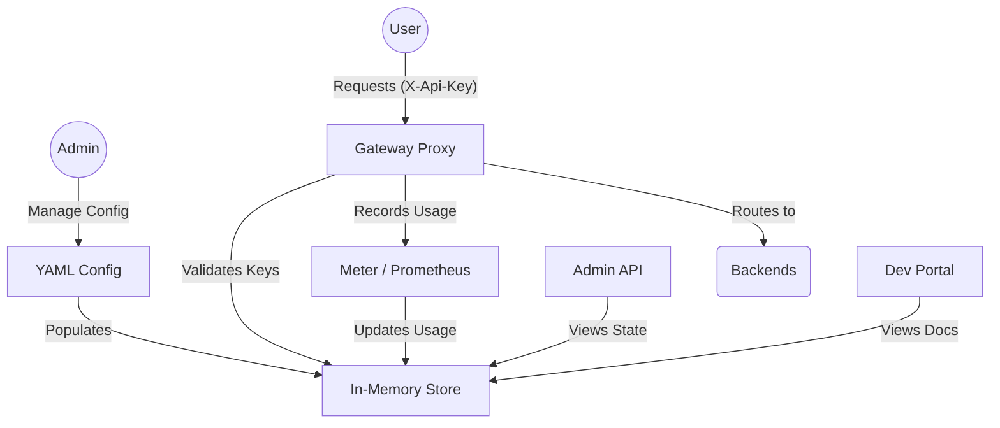

# APIM Core Architecture

APIM Core is built with a hexagonal-inspired architecture, emphasizing modularity and clear separation of concerns.

## Component Overview

### 1. Configuration (`config/`)
Handles the parsing and monitoring of the `config.yaml` file. It supports hierarchical definitions of products and APIs.

### 2. Store (`internal/store/`)
An optimized, thread-safe in-memory storage that holds the entire state of the system, including API definitions, subscriptions, and usage records.

### 3. Gateway (`internal/gateway/`)
The main proxy engine. It handles:
- Path-based routing.
- API Key validation.
- Tenant ID propagation.
- Response recording for metrics.

### 4. Meter (`internal/meter/`)
Bridges the Gateway and Prometheus. It collects real-time statistics on request counts, latency, and status codes.

### 5. Management Server (`internal/admin/` & `internal/devportal/`)
Provides the REST APIs and UI for administrators and developers to interact with the system's runtime state.
