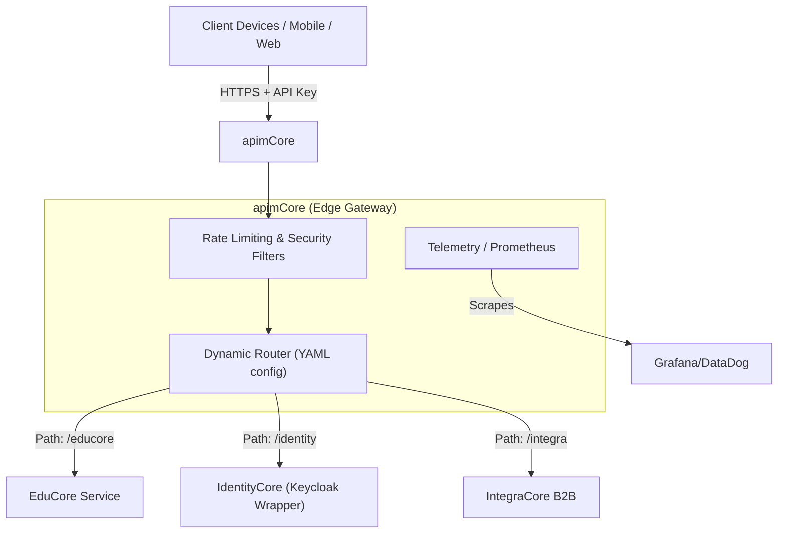

# Platform Design Document: apimCore (API Management Gateway)

> **Template Origin**: Official ArcKit | **ArcKit Version**: 4.6.11 | **Command**: `/arckit.platform-design`

## Document Control

| Field | Value |
|-------|-------|
| **Document ID** | ARC-NAV-003-PLAT |
| **Document Type** | Platform Design |
| **Project** | apimCore |
| **Classification** | OFFICIAL |
| **Status** | APPROVED |
| **Version** | 1.0.0 |
| **Created Date** | 2026-04-18 |

---

## 1. Platform Overview

### 1.1 Purpose
`apimCore` is the high-performance, edge API Gateway for the entire Navante ecosystem. Written in Go 1.24+, it acts as the centralized point for reverse proxying traffic, terminating rate-limits, enforcing tenant segregation, and gathering Edge Telemetry before traffic reaches the downstream backends (`EduCore`, `CampusCore`, `IdentityCore`, `IntegraCore`).

### 1.2 Key Capabilities
- **Path-Based & Domain Routing**: Multi-product routing using URL matching or specific subdomains.
- **Security & Authorization**: Embedded rate limiting (RPS/burst), Geo-fencing via GeoIP, and CIDR blacklisting.
- **Tenant-Aware Processing**: Injects `X-Tenant-Id` headers dynamically based on inbound API Keys.
- **Management TUI & Observability**: Real-time terminal UI, combined with Prometheus metric scraping interfaces (`/metrics`).
- **Dev Portal Generation**: Aggregates internal OpenAPI schemas into a centralized portal.

---

## 2. Platform Architecture

### 2.1 Logical Architecture

### 2.2 Component Boundaries

| Module | Responsibility | Runtime Paradigm |
|--------|----------------|------------------|
| **Core Proxy Engine** | In-memory key caching, HTTP/2 multiplexing, TLS termination. | Golang Routines |
| **Admin API** | Configuration hot-reloading (`-hot-reload`), DevPortal embedding. | Server Port (ex: 8081) |
| **Telemetry System**| Tracking P95/P99 latency, Tenant usage volume per product. | HTTP Scraper |

---

## 3. Operations & Deployment

### 3.1 Deployment Strategy
The gateway is packaged via standard Golang cross-compilation processes and distributed in multiple formats (`.deb`, `.rpm`, `.exe`, Docker `ghcr.io`). To comply with the Enterprise Architecture Principles (**ARC-NAV-001**), production deployments will primarily utilize Docker images.

### 3.2 Configuration Management
Configuration relies entirely on `config.yaml`. There is no persistent internal database for route configurations, which prevents state drift across Gateway nodes.

**Hot-Reload Capability**:
Production nodes run with `-hot-reload` or rely on zero-downtime rolling updates in Kubernetes/Compose ensuring existing client streams are gracefully drained. 

---

## 4. Threat Model & Compliance

| Threat | Control | Assessment |
|--------|---------|------------|
| **DDoS Attacks (Layer 7)** | `security.rate_limit.burst` settings dropping requests at the Edge memory layer before reaching Tomcat engines. | ✅ Complete |
| **Abusive Tenants** | Tenant-specific API keys tracked by `subscriptions.keys`. If compromised or over-utilizing, isolated keys are revoked in YAML. | ⚠️ Add Dynamic Key Backend |
| **Unauthorized Regional Access** | `allowed_countries` YAML settings utilizing MaxMind / GeoIP to strictly limit connections outside acceptable operation zones. | ✅ Complete |

---

## 5. Extensibility Roadmap

The following tasks represent the platform's evolutionary roadmap:
1. **Dynamic Provider Backends**: While YAML currently dictates logic, integrating `IdentityCore` to dynamically provide the `subscriptions` structure in-memory via Redis.
2. **WAF Capabilities**: Bolstering Go filters to automatically drop known SQLi and XSS payloads.

**Generated by**: ArcKit Strategy Generator
